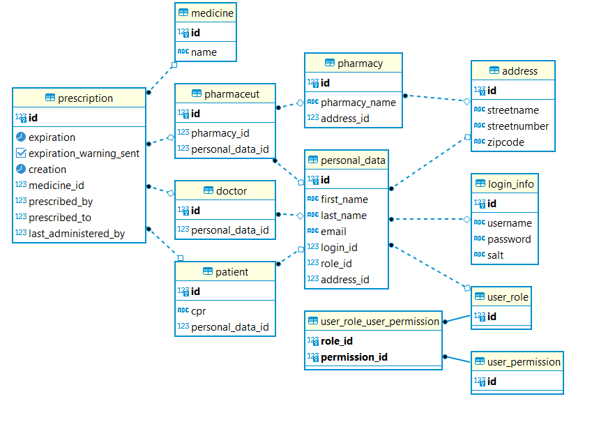

# db_assignment2_prescription_reminder

To scaffold with database first:
dotnet ef dbcontext scaffold "Host=localhost;Port=15432;Database=prescription_db;Include Error Detail=true;Username=prescription_user;Password=prescription_pw" Npgsql.EntityFrameworkCore.PostgreSQL --force

Endpoints when running docker compose:
localhost:14080/Prescription GET
localhost:14081/Renewal GET
localhost:14082/api/Email/send POST (Body -> mailrequest)
